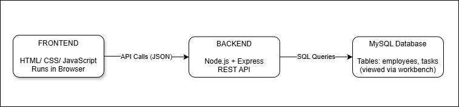
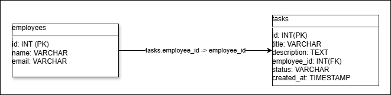
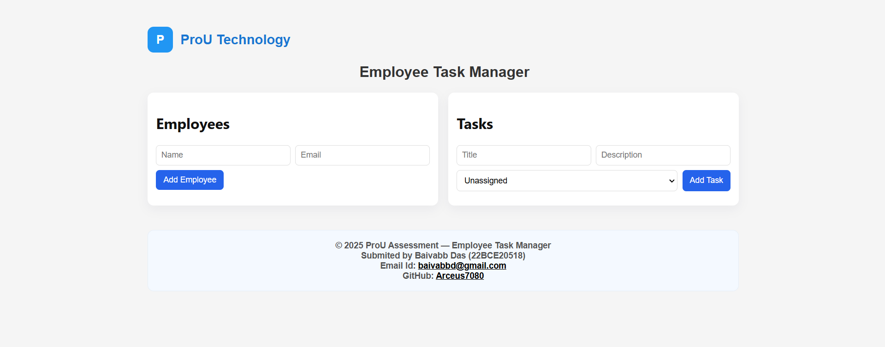
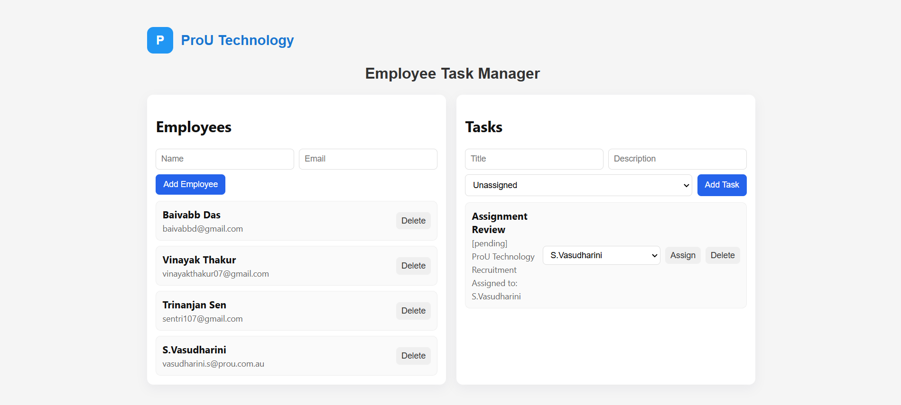
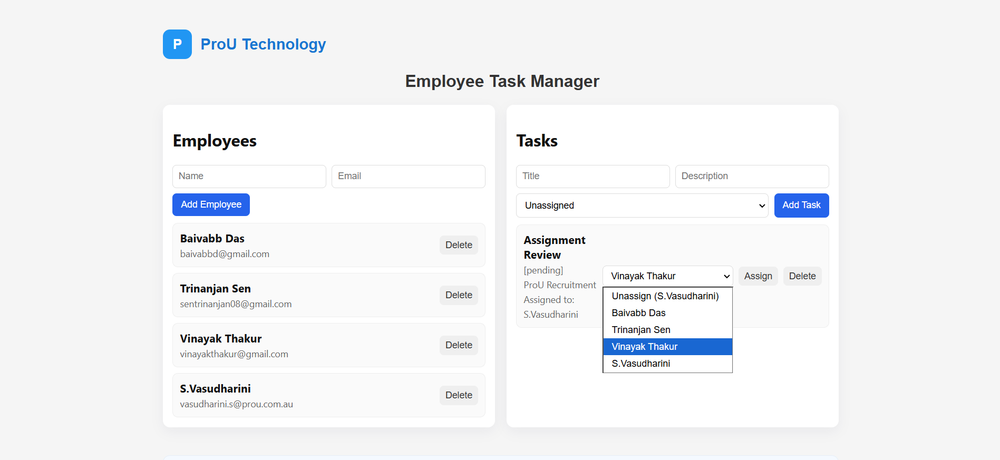

# ProU Assessment — Employee Task Manager

A simple full-stack application built for the ProU Frontend/Backend/Full-Stack Developer Assessment.

This project includes:
- A clean and responsive **HTML/CSS/JavaScript frontend**
- A **Node.js + Express backend**
- A **MySQL database**, with Workbench for visualization
- REST APIs for managing **Employees** and **Tasks**, with the ability to **assign/unassign tasks**

---

## Project Overview

This Employee Task Manager allows:
- Adding, viewing, updating, and deleting **employees**
- Adding, viewing, updating, assigning, unassigning, and deleting **tasks**
- Viewing all tasks along with the assigned employee
- Fully persistent storage using MySQL

The UI is intentionally built in **plain HTML, CSS, and JavaScript** (no frameworks), as per the assessment’s requirement.

---

## System Architecture

### System Design  
Frontend (Browser) → Backend (Node.js/Express) → MySQL (Workbench)



---

### Database Schema (ER Diagram)

The application uses two tables: `employees` and `tasks`.



---

## Setup Steps

### **Prerequisites**
- Node.js (v16+ recommended)
- MySQL Server installed & running locally
- MySQL Workbench or phpMyAdmin (optional but helpful)

---

### **1. Create the database and user**

Run this in MySQL Workbench or terminal:

```sql
CREATE DATABASE IF NOT EXISTS prou_db;
CREATE USER IF NOT EXISTS 'prou_user'@'localhost' IDENTIFIED BY 'prou_pass';
GRANT ALL PRIVILEGES ON prou_db.* TO 'prou_user'@'localhost';
FLUSH PRIVILEGES;
```

### **2. Run migrations**

Run the following command in your terminal:

```bash
mysql -u root -p prou_db < backend/migration.sql
```

### **3. Configure environment**

Duplicate .env.example → rename it to .env, then update values if needed:

```javascript
DB_HOST=localhost
DB_PORT=3306
DB_USER=prou_user
DB_PASSWORD=prou_pass
DB_NAME=prou_db
PORT=4000
```
### **4. Start backend**

```bash
cd backend
npm install
npm start
```
The backend will start at:

```arduino
http://localhost:4000
```

### **5. Open frontend**

Option A (Direct)

Open this file in any browser:

```bash
frontend/index.html
```

Option B (Recommended for CORS-free testing)

Serve frontend via a lightweight static server:

```bash
npx http-server frontend -p 5500
```

Then open:

```bash
http://localhost:5500
```

### **6. Test API manually**

```bash
curl http://localhost:4000/api/employees
```

### **7. API Endpoints**

`- GET  /api/employees`
`- POST /api/employees {name,email}`
`- PUT  /api/employees/:id`
`- DELETE /api/employees/:id`

`- GET  /api/tasks`
`- POST /api/tasks {title,description,employee_id,status}`
`- PUT  /api/tasks/:id`
`- DELETE /api/tasks/:id`

### **8. Tech Stack Used**

**Frontend:**
`HTML`
`CSS`
`Vanilla JavaScript`
`Fetch API`

**Backend:**
`Node.js`
`Express.js`
`mysql2 (promise API)`
`body-parser`
`cors`

**Database:**
`MySQL`
`MySQL Workbench (for viewing tables)`

### **9. Demo**

**Frontend:**

**Adding an Employee:**

**Assigning a task to a Employee:**

**Changing the assigned task to a different employee or unassigning the task:**


### ***10. Assumptions***

* Application is intended to run locally for the assessment.
* No user authentication is required.
* `PUT /api/tasks/:id` updates the entire task, not partial fields.
* The database user `prou_user` is only for local development.
* Simple, minimalistic UI is acceptable per assignment requirements.

### ***11. Bonus Features Implemented***

* Assign / Unassign tasks to employees directly from UI.
* Fully responsive, clean frontend.
* `.env.example` + `migration.sql` for quick setup.
* clean folder structure.
* System design diagram included.
* ER Diagram included.
* Safe error handling in frontend and backend.

<div style="text-align: center;">Thank You</div>


